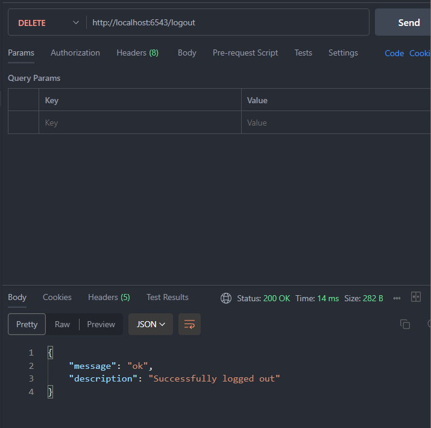

# The Movies Python Pyramid
Tugas 4  Pemrograman Web Lanjut

## Cara Menggunakan Project ini
- install pip, python dan mysql terlebih dahulu
- install library yang dibutuhkan dengan `pip install -r requirements.txt`
- Import ke database anda menggunakan file `pyramid-themovies.sql`
- jalankan projek dengan `python app.py`
- gunakan postman dengan import file `The Movies API.postman_collection.json` atau request api sejenisnya
- jalankan unit test dengan `python unittest.py`

## Alur Kerja Projek ini
- project hanya dapat berjalan di `localhost:6543`
- User dapat mengunjungi `root` atau biasa disebut dengan `index link`
- User diharapkan Register untuk menggunakan fitur yang ada dengan endpoint `register`
- User diharapkan Login untuk keperluan otentikasi menggunakan JWT dimana token JWT disimpan ke dalam cookies dengan endpoint `login`
- Token akan aktif selama `30 menit`, jika melewati 30 menit maka token akan Expired dan user diharapkan login ulang untuk membuat token baru
- user dapat mengakses endpoint `home` yang digunakan untuk melihat data film
- user dapat menambahkan list data film melalui endpoint `create`
- user dapat meng-update data berdasarkan id film dengan endpoint `update`
- user dapat menghapus data film berdasarkan id film dengan endpoint `delete`
- user dapat logout dengan endpoint `logout` dimana Token pada database dan cookies akan dihapus secara permanen

## Unit Test
Menggunakan unittest dari library python dan pyramid, dimana unittest ini sudah terhubung langsung dengan database.

Hasil Unit Test

## Ingin melihat hasilnya?
- Jalankan projek dahulu, lalu
[klik disini](https://www.postman.com/lunar-comet-757420/workspace/pwl-tugas-4/collection/30672519-de1b6f3a-45d6-4eea-a315-b69d810a6ae7?action=share&creator=30672519) untuk menggunakan postman atau bisa anda import dari file postman yang saya sediakan
- Atau dapat dilihat pada gambar dibawah ini

Root

Menggunakan method get tanpa form data, untuk mengecek apakah server dan API berjalan

Register

Menggunakan method post dengan form data username dan password

Login

Menggunakan method post dengan form data username dan password dan diberikan respon data berupa token untuk autentikasi JWT

Home

Menggunakan method get tanpa form data dan menghasilkan data list movie yang sudah pernah di input oleh user

Create Data

Menggunakan method post dengan form data judul, genre, tahun(int), director

Update Data

Menggunakan method put dengan form data id, judul, genre, tahun(int), director

Delete Data

Menggunakan method delete dengan form data id

Logout

Menggunakan method delete tanpa form data

